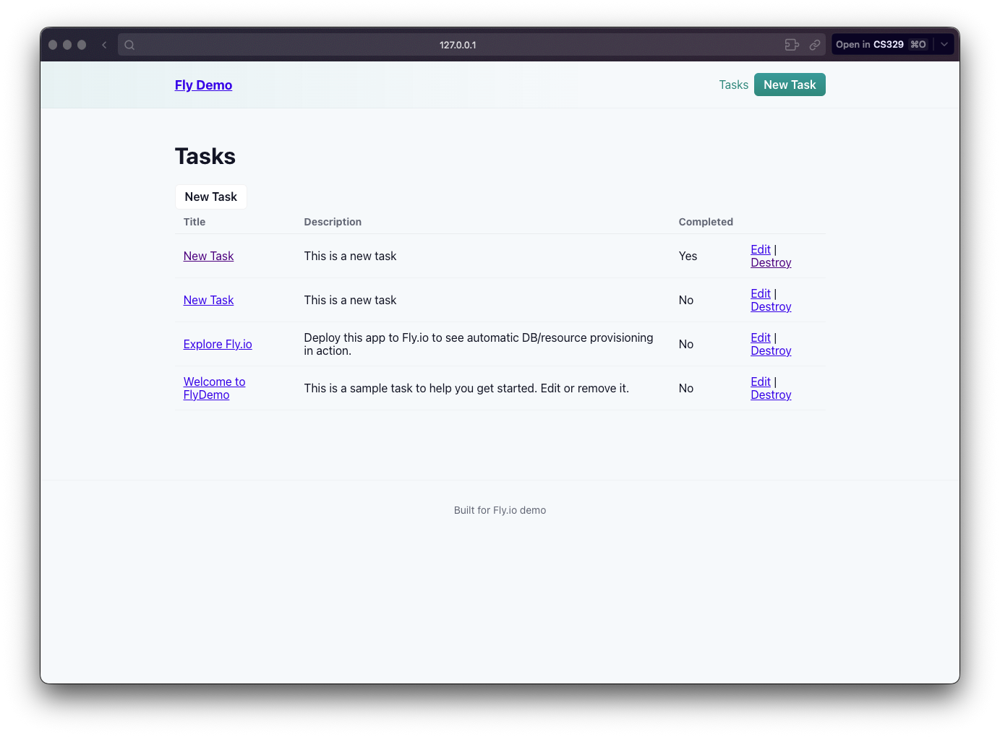

## How Everything Can Be Automated Using Fly.io
Throughout this course, we've learned about the importance of automation.  We've also learned how time intensive it can be to setup all of the automated features for deploying our app.  What if the entire deploy process (including setting up a database, background job processor, and bucket storage) right at the beginning.  This may sound like an impossibility, but with a tool like [Fly](https://fly.io/) and the right framework, manually configuring cloud applications can be a thing of the past.

### What is Fly.io?
To put it simply, Fly.io is a cloud provider.  Like AWS, they have data centers and allow you to rent compute and charge you based on how much compute you use.  Unlike AWS, Fly.io is opinionated and makes it very easy to set things up if you use a supported framework or run your app from a docker container.  Some might find this mind set limiting, and it is, but sometimes limitation can help an app be more focused.  You can't do everything on Fly, but it can do most web app related things.

### JWT Pizza on Fly

JWT Pizza has 3 main parts we need deployed, the front end client code, the backend server code, and the database.  The JavaScript frameworks we use for JWT pizza were not listed under the supported frameworks section, so it will be interesting to see how this goes.

### Front End

In the fly dashboard, there is a "Launch an App" button.  Clicking on the button bring you to page where you select a github repository.  I selected JWT-Pizza and clicked launch.

Without asking me any configuration questions, a build and deploy process started and within minutes the app was up and running.

As part of the process, Fly created a branch in jwt-pizza with a few new files that aided in the deploy.  The branch included a Dockerfile, a fly.toml file, and a .dockerignore.  Here is a screenshot of the pull request Fly made to merge the changes:

### Backend Deployment

The backend is more complicated.  It requires a config.js file to be created during the deploy process, which includes credentials for a database connection.  Let's see how Fly handles this complexity.  Due to these complexities and the lack of support, I expect the backend to require more configuration and will likely fail on the first attempt

I started by clicking the same button I used for the front end, and as expected, the deploy failed.

Looking into the logs reveals that the issue is related to the missing config file, which is not unexpected.  How was fly suppose to know about the config file?  The solution to this would be giving Fly the docker image for our app rather than the code, but that would require us to configure the image repo and the database on our own, which defeats the purpose of using Fly.

So, Fly doesn't work well with non-supported frameworks, but what if our app is built in a supported framework?

## Rails on Fly
Fly excels with it's working with frameworks it understands, and one of those frameworks is Ruby on Rails.  Let's build a demo Rails app and attempt to deploy it using Fly.

To show case the automation that Fly is offering, I had AI build a simple rails application where a user can create and edit tasks.
This app requires a database to persist the data, so we can test if Fly can set up everything we need.  To deploy this app, I'm going to use Fly CLI.  

The CLI offered more configuration options, including the option to setup a managed postgres database. Once the app was configured and the fly.toml file was generated, I was able to run `fly deploy` to deploy the app.  After resolving a few Dockerfile issues, the app deployed and I was able to see it's status in my Fly dashboard.

At first, the app wasn't working because It couldn't find the database, but after poking around I found a button to connect the database to the app.

And that didn't work either... After multiple attempts I was not able to get the app working on Fly.

## Conclusion
The idea behind Fly is great, but in practice it doesn't work like they advertise.  When it comes to deploying web apps, the best way is to configure all the components yourself.  While it may seem nice to offload that work to someone else, having control over your app is more important (and will lead to less headache).  Don't use Fly.
